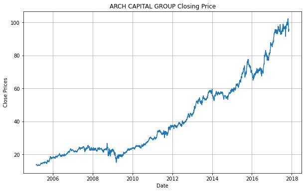
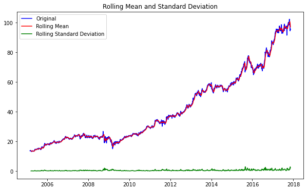
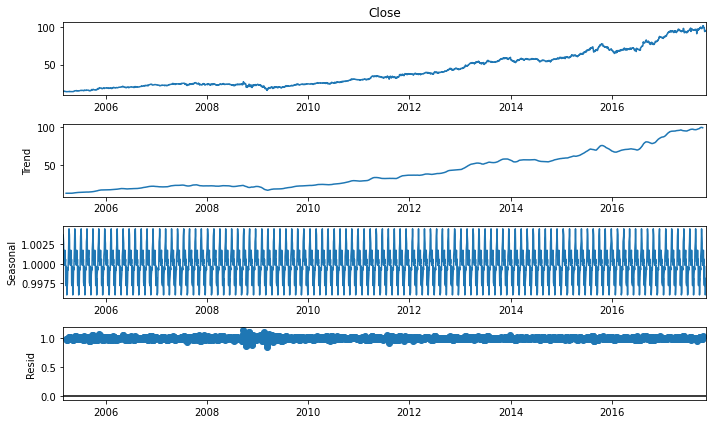
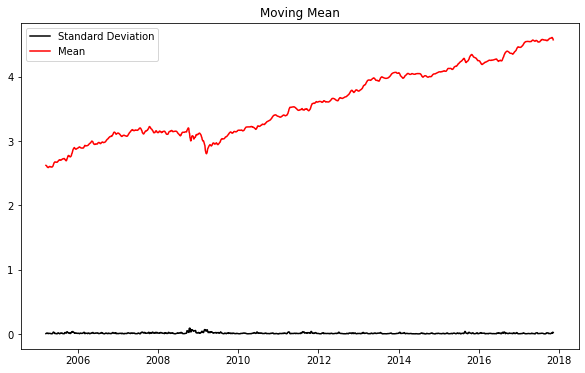
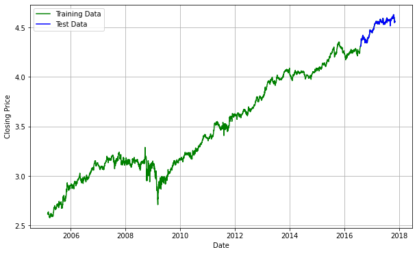
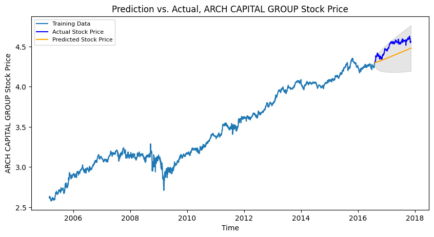

```python
!pip install pmdarima
```

    Requirement already satisfied: pmdarima in /Users/yangzi33/anaconda3/envs/ml/lib/python3.7/site-packages (1.8.0)
    Requirement already satisfied: setuptools!=50.0.0,>=38.6.0 in /Users/yangzi33/anaconda3/envs/ml/lib/python3.7/site-packages (from pmdarima) (49.6.0.post20200814)
    Requirement already satisfied: statsmodels!=0.12.0,>=0.11 in /Users/yangzi33/anaconda3/envs/ml/lib/python3.7/site-packages (from pmdarima) (0.12.2)
    Requirement already satisfied: scipy>=1.3.2 in /Users/yangzi33/anaconda3/envs/ml/lib/python3.7/site-packages (from pmdarima) (1.4.1)
    Requirement already satisfied: joblib>=0.11 in /Users/yangzi33/anaconda3/envs/ml/lib/python3.7/site-packages (from pmdarima) (0.16.0)
    Requirement already satisfied: urllib3 in /Users/yangzi33/anaconda3/envs/ml/lib/python3.7/site-packages (from pmdarima) (1.24.3)
    Requirement already satisfied: numpy>=1.17.3 in /Users/yangzi33/anaconda3/envs/ml/lib/python3.7/site-packages (from pmdarima) (1.18.5)
    Requirement already satisfied: pandas>=0.19 in /Users/yangzi33/anaconda3/envs/ml/lib/python3.7/site-packages (from pmdarima) (1.1.1)
    Requirement already satisfied: Cython<0.29.18,>=0.29 in /Users/yangzi33/anaconda3/envs/ml/lib/python3.7/site-packages (from pmdarima) (0.29.17)
    Requirement already satisfied: scikit-learn>=0.22 in /Users/yangzi33/anaconda3/envs/ml/lib/python3.7/site-packages (from pmdarima) (0.23.2)
    Requirement already satisfied: patsy>=0.5 in /Users/yangzi33/anaconda3/envs/ml/lib/python3.7/site-packages (from statsmodels!=0.12.0,>=0.11->pmdarima) (0.5.1)
    Requirement already satisfied: python-dateutil>=2.7.3 in /Users/yangzi33/anaconda3/envs/ml/lib/python3.7/site-packages (from pandas>=0.19->pmdarima) (2.8.1)
    Requirement already satisfied: pytz>=2017.2 in /Users/yangzi33/anaconda3/envs/ml/lib/python3.7/site-packages (from pandas>=0.19->pmdarima) (2020.1)
    Requirement already satisfied: threadpoolctl>=2.0.0 in /Users/yangzi33/anaconda3/envs/ml/lib/python3.7/site-packages (from scikit-learn>=0.22->pmdarima) (2.1.0)
    Requirement already satisfied: six in /Users/yangzi33/anaconda3/envs/ml/lib/python3.7/site-packages (from patsy>=0.5->statsmodels!=0.12.0,>=0.11->pmdarima) (1.15.0)


```python
import os
import warnings
warnings.filterwarnings('ignore')

import numpy as np
import pandas as pd
import matplotlib.pyplot as plt
from pylab import rcParams
rcParams['figure.figsize'] = 10, 6
from statsmodels.tsa.stattools import adfuller
from statsmodels.tsa.seasonal import seasonal_decompose
from statsmodels.tsa.arima_model import ARIMA
from pmdarima.arima import auto_arima

from sklearn.metrics import mean_squared_error, mean_absolute_error
import math
```


```python
# Print data file names
data_path = os.path.join("input", "Stocks")
for dirname, _, filenames, in os.walk(data_path):
  for filename in filenames:
    print(os.path.join(dirname, filename))
```


```python
dateparse = lambda dates: pd.datetime.strptime(dates, "%Y-%m-%d")
dat = pd.read_csv(os.path.join(data_path, "acgl.us.txt"), sep=',', index_col="Date", parse_dates=['Date'], date_parser=dateparse).fillna(0)
```


```python
dat
```


<div>
<style scoped>
    .dataframe tbody tr th:only-of-type {
        vertical-align: middle;
    }

    .dataframe tbody tr th {
        vertical-align: top;
    }

    .dataframe thead th {
        text-align: right;
    }
</style>
<table border="1" class="dataframe">
  <thead>
    <tr style="text-align: right;">
      <th></th>
      <th>Open</th>
      <th>High</th>
      <th>Low</th>
      <th>Close</th>
      <th>Volume</th>
      <th>OpenInt</th>
    </tr>
    <tr>
      <th>Date</th>
      <th></th>
      <th></th>
      <th></th>
      <th></th>
      <th></th>
      <th></th>
    </tr>
  </thead>
  <tbody>
    <tr>
      <th>2005-02-25</th>
      <td>13.583</td>
      <td>13.693</td>
      <td>13.430</td>
      <td>13.693</td>
      <td>156240</td>
      <td>0</td>
    </tr>
    <tr>
      <th>2005-02-28</th>
      <td>13.697</td>
      <td>13.827</td>
      <td>13.540</td>
      <td>13.827</td>
      <td>370509</td>
      <td>0</td>
    </tr>
    <tr>
      <th>2005-03-01</th>
      <td>13.780</td>
      <td>13.913</td>
      <td>13.720</td>
      <td>13.760</td>
      <td>224484</td>
      <td>0</td>
    </tr>
    <tr>
      <th>2005-03-02</th>
      <td>13.717</td>
      <td>13.823</td>
      <td>13.667</td>
      <td>13.810</td>
      <td>286431</td>
      <td>0</td>
    </tr>
    <tr>
      <th>2005-03-03</th>
      <td>13.783</td>
      <td>13.783</td>
      <td>13.587</td>
      <td>13.630</td>
      <td>193824</td>
      <td>0</td>
    </tr>
    <tr>
      <th>...</th>
      <td>...</td>
      <td>...</td>
      <td>...</td>
      <td>...</td>
      <td>...</td>
      <td>...</td>
    </tr>
    <tr>
      <th>2017-11-06</th>
      <td>94.490</td>
      <td>95.650</td>
      <td>94.020</td>
      <td>95.550</td>
      <td>420192</td>
      <td>0</td>
    </tr>
    <tr>
      <th>2017-11-07</th>
      <td>95.860</td>
      <td>95.950</td>
      <td>95.200</td>
      <td>95.560</td>
      <td>464011</td>
      <td>0</td>
    </tr>
    <tr>
      <th>2017-11-08</th>
      <td>95.410</td>
      <td>95.900</td>
      <td>94.890</td>
      <td>95.450</td>
      <td>471756</td>
      <td>0</td>
    </tr>
    <tr>
      <th>2017-11-09</th>
      <td>94.930</td>
      <td>96.140</td>
      <td>94.470</td>
      <td>95.910</td>
      <td>353498</td>
      <td>0</td>
    </tr>
    <tr>
      <th>2017-11-10</th>
      <td>95.890</td>
      <td>95.990</td>
      <td>94.390</td>
      <td>95.350</td>
      <td>452833</td>
      <td>0</td>
    </tr>
  </tbody>
</table>
<p>3201 rows × 6 columns</p>
</div>


Visualizing closing price of stock by days


```python
plt.grid(True)
plt.xlabel("Date")
plt.ylabel("Close Prices")
plt.plot(dat["Close"])
plt.title("ARCH CAPITAL GROUP Closing Price")
plt.show()
```





Prob distribution of series


```python
dat["Close"].plot(kind="kde")
```


    <AxesSubplot:ylabel='Density'>


Given a time series, we consist three systematic components:

*   **Level**: The mean value in the series
*   **Trend**: The increasing/decreasing value in the series
*   **Seasonality**: The periodic short-term cycle in the series

We consist a non-systematic component in addition:

*   ** Noise**: The random variation in the series

We check whether the series is stationary by carrying out *ADF Test*, since time series analysis only works on stationary data.


## Augmented Dickey-Fuller Test

**Null Hypothesis** ($H_0$): The series has a unit root.
**Alternative Hypothesis** ($H_A$): The series has no unit root.

By rejecting $H_0$, we conclude that our series in non-stationary; otherwise, we are confident that both mean and standard deviation are constant, i.e. the series is stationary.


```python
# Testing stationarity
def test_stationarity(timeseries):
  rolmean = timeseries.rolling(12).mean()
  rolstd = timeseries.rolling(12).std()

  # Plots
  plt.plot(timeseries, color="blue", label="Original")
  plt.plot(rolmean, color="red", label="Rolling Mean")
  plt.plot(rolstd, color="green", label="Rolling Standard Deviation")
  plt.legend(loc="best")
  plt.title("Rolling Mean and Standard Deviation")
  plt.show(block=False)

  print("Results of ADF Test: ")
  adft = adfuller(timeseries, autolag="AIC")

  index_lst = ["Test Statistics", "P-Value", "# of Lags Used", "# of Observations Used"]
  out = pd.Series(adft[0:4], index=index_lst)
  for key, value in adft[4].items():
    out["critical value (%s)"%key] = value

  print(out)

```


```python
test_stationarity(dat["Close"])
```





    Results of ADF Test: 
    Test Statistics              1.374899
    P-Value                      0.996997
    # of Lags Used               5.000000
    # of Observations Used    3195.000000
    critical value (1%)         -3.432398
    critical value (5%)         -2.862445
    critical value (10%)        -2.567252
    dtype: float64


We observe mean and standard deviation implies that the series is not stationary. We alsoz observe that the p-value is high, hence no evidence to reject the null hypothesis. Furthermore, test statistics are greater than AIC (critical) values.


```python
seasonal_result = seasonal_decompose(dat["Close"], model="multiplicative", freq = 30)
fig = plt.figure()
fig = seasonal_result.plot()
```


    <Figure size 720x432 with 0 Axes>





We take logarithms of the series to reduce the magnitude of values and reduce the *rising* trend. Then we find the rolling averrage of the series.

Def. Rolling average is calculated by taking input for the past 12 months and giving a meanconsumption value at every point further ahead in series.


```python
# Eliminate trend if not stationary
dat_log = np.log(dat["Close"])
moving_mean = dat_log.rolling(12).mean()
moving_std = dat_log.rolling(12).std()

plt.legend(loc="best")
plt.title("Moving Mean")
plt.plot(moving_std, color="black", label="Standard Deviation")
plt.plot(moving_mean, color="red", label="Mean")
plt.legend()
plt.show()
```

    No handles with labels found to put in legend.





```python
# Splitting data
# CV might be an ideal choice but we stick with this for now
train_dat, test_dat = dat_log[3:int(len(dat_log)*0.9)], dat_log[int(len(dat_log)*0.9):]
plt.grid(True)
plt.xlabel("Date")
plt.ylabel("Closing Price")
plt.plot(dat_log, "Green", label="Training Data")
plt.plot(test_dat, "Blue", label="Test Data")
plt.legend()
```


    <matplotlib.legend.Legend at 0x7f9e583ffa50>





## ARIMA Model
We choose parameters $p, q, d$ for the ARIMA model.

Def. AutoARIMA (Automatically discover the optimal order for an ARIMA Model

Function auto_arima seeks to identify the most optimal parameters for an ARIMA model, and returns a fitted ARIMA model. This function is based on R's `forecase::auto.arima`.

Function `auto_arima` works by conducting difference tests (e.g. ADF, Phillips-Perron, Kwiatkowski_Phillips-Schmidt-Shin,..) to determine the order of differencing $d$. Then, it fits models within defined ranges of `start_p`, `max_p`, `start_q`, `max_q`.

If seasonal optional is enabled, `auto_arima` seeks to indentify the optimal `p,q` hyperparameters after coinducting the **Canova-Hanson** to determine the optimal order of seasonal differencing $D$.


```python
model_autoARIMA = auto_arima(train_dat, start_p=0, start_q=0,
                             test='adf',  # Find optimal d with ADF test
                             max_p=3, max_q=3,
                             m=1,         # Frequency of series
                             d=None,       # Let the model determine d
                             seasonal=False, # No seasonality
                             start_P=0,
                             D=0,
                             trace=True,
                             error_action="ignore",
                             suppress_warnings=True,
                             stepwise=True)

print(model_autoARIMA.summary())
model_autoARIMA.plot_diagnostics(figsize=(15,8))
plt.show()
```

    Performing stepwise search to minimize aic
     ARIMA(0,1,0)(0,0,0)[0] intercept   : AIC=-16491.508, Time=0.33 sec
     ARIMA(1,1,0)(0,0,0)[0] intercept   : AIC=-16525.992, Time=0.17 sec
     ARIMA(0,1,1)(0,0,0)[0] intercept   : AIC=-16527.964, Time=0.35 sec
     ARIMA(0,1,0)(0,0,0)[0]             : AIC=-16488.323, Time=0.11 sec
     ARIMA(1,1,1)(0,0,0)[0] intercept   : AIC=-16527.157, Time=0.72 sec
     ARIMA(0,1,2)(0,0,0)[0] intercept   : AIC=-16527.120, Time=0.97 sec
     ARIMA(1,1,2)(0,0,0)[0] intercept   : AIC=-16528.810, Time=0.69 sec
     ARIMA(2,1,2)(0,0,0)[0] intercept   : AIC=inf, Time=1.35 sec
     ARIMA(1,1,3)(0,0,0)[0] intercept   : AIC=-16526.020, Time=1.28 sec
     ARIMA(0,1,3)(0,0,0)[0] intercept   : AIC=-16524.974, Time=0.69 sec
     ARIMA(2,1,1)(0,0,0)[0] intercept   : AIC=-16525.435, Time=0.47 sec
     ARIMA(2,1,3)(0,0,0)[0] intercept   : AIC=-16516.417, Time=0.34 sec
     ARIMA(1,1,2)(0,0,0)[0]             : AIC=-16527.597, Time=0.33 sec
    
    Best model:  ARIMA(1,1,2)(0,0,0)[0] intercept
    Total fit time: 7.815 seconds
                                   SARIMAX Results                                
    ==============================================================================
    Dep. Variable:                      y   No. Observations:                 2877
    Model:               SARIMAX(1, 1, 2)   Log Likelihood                8269.405
    Date:                Wed, 17 Feb 2021   AIC                         -16528.810
    Time:                        17:54:00   BIC                         -16498.989
    Sample:                             0   HQIC                        -16518.061
                                   - 2877                                         
    Covariance Type:                  opg                                         
    ==============================================================================
                     coef    std err          z      P>|z|      [0.025      0.975]
    ------------------------------------------------------------------------------
    intercept   2.467e-05   7.12e-06      3.464      0.001    1.07e-05    3.86e-05
    ar.L1          0.9538      0.009    104.140      0.000       0.936       0.972
    ma.L1         -1.0708      0.015    -73.566      0.000      -1.099      -1.042
    ma.L2          0.0877      0.012      7.504      0.000       0.065       0.111
    sigma2         0.0002   2.32e-06     80.805      0.000       0.000       0.000
    ===================================================================================
    Ljung-Box (L1) (Q):                   0.00   Jarque-Bera (JB):              7207.33
    Prob(Q):                              0.97   Prob(JB):                         0.00
    Heteroskedasticity (H):               0.30   Skew:                            -0.39
    Prob(H) (two-sided):                  0.00   Kurtosis:                        10.72
    ===================================================================================
    
    Warnings:
    [1] Covariance matrix calculated using the outer product of gradients (complex-step).


TODO: Interpret diagnostic plots

The auto ARIMA model provides
$$p=1, d=1, q=2$$

We move on to buidling the model.


```python
model = ARIMA(train_dat, order=(1, 1, 2))
fitted = model.fit(disp=-1)
print(fitted.summary())
```

                                 ARIMA Model Results                              
    ==============================================================================
    Dep. Variable:                D.Close   No. Observations:                 2876
    Model:                 ARIMA(1, 1, 2)   Log Likelihood                8274.158
    Method:                       css-mle   S.D. of innovations              0.014
    Date:                Wed, 17 Feb 2021   AIC                         -16538.316
    Time:                        17:54:01   BIC                         -16508.496
    Sample:                             1   HQIC                        -16527.567
                                                                                  
    =================================================================================
                        coef    std err          z      P>|z|      [0.025      0.975]
    ---------------------------------------------------------------------------------
    const             0.0006      0.000      3.935      0.000       0.000       0.001
    ar.L1.D.Close     0.9145      0.040     22.744      0.000       0.836       0.993
    ma.L1.D.Close    -1.0351      0.045    -23.131      0.000      -1.123      -0.947
    ma.L2.D.Close     0.0848      0.022      3.820      0.000       0.041       0.128
                                        Roots                                    
    =============================================================================
                      Real          Imaginary           Modulus         Frequency
    -----------------------------------------------------------------------------
    AR.1            1.0934           +0.0000j            1.0934            0.0000
    MA.1            1.0578           +0.0000j            1.0578            0.0000
    MA.2           11.1422           +0.0000j           11.1422            0.0000
    -----------------------------------------------------------------------------


```python
# Predictions
pred, se, CI = fitted.forecast(321, alpha=0.05)  # 95% Confidence Interval
```


```python
pred_series = pd.Series(pred, index=test_dat.index)
lower_series = pd.Series(CI[:, 0], index=test_dat.index)
upper_series = pd.Series(CI[:, 1], index=test_dat.index)

plt.figure(figsize=(10, 5), dpi=100)
plt.plot(train_dat, label="Training Data")
plt.plot(test_dat, color="blue", label="Actual Stock Price")
plt.plot(pred_series, color="orange", label="Predicted Stock Price")
plt.fill_between(lower_series.index, lower_series, upper_series, color="k", alpha=.1)
plt.title("Prediction vs. Actual, ARCH CAPITAL GROUP Stock Price")
plt.xlabel("Time")
plt.ylabel("ARCH CAPITAL GROUP Stock Price")
plt.legend(loc="upper left", fontsize=8)
plt.show()
```





```python
# Performance Report
mse = mean_squared_error(test_dat, pred)
mae = mean_absolute_error(test_dat, pred)
rmse = math.sqrt(mse)
mape = np.mean(np.abs(pred - test_dat) /np.abs(test_dat))

print("MSE: " + str(mse))
print("MAE: " + str(mae))
print("RMSE: " + str(rmse))
print("MAPE: " + str(mape))
```

    MSE: 0.01507666296604363
    MAE: 0.11501013309418054
    RMSE: 0.1227870635125852
    MAPE: 0.02539749531590509


~2.5% MAPE implies that our model is 97.5% accurate in predicting the next 15 observations.
